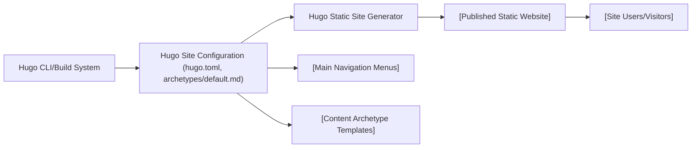

# Hugo Site Configuration

## Overview
The Hugo Site Configuration module defines the primary behavior and structure of your static site built with [Hugo](https://gohugo.io/). It sets up global site settings, navigation menus, and the default template for new content. These configurations ensure the site is correctly structured, titled, and easy to navigate, and provide a consistent starting point for all new posts or pages.

## Key Features
- **Global Site Settings**: Sets fundamental parameters such as base URL, language, site title, and visual theme for consistent site identity and accessibility.
- **Main Navigation Menu**: Declares main menu entries (Accueil, Blog, About) to facilitate user navigation throughout the website.
- **Default Content Archetype**: Defines a content blueprint for new pages/posts incorporating default metadata (title, date, draft status), streamlining content creation and ensuring uniformity.

## System Errors
- **Missing Configuration Error**: If essential fields (like `baseURL` or `theme`) are missing or misconfigured in `hugo.toml`, Hugo build commands (`hugo serve`, `hugo build`) may fail with configuration errors.  
  **Resolution**: Ensure all mandatory fields are present and spelled correctly in `hugo.toml`.
- **Archetype Placeholder Errors**: If archetype variables are not correctly resolved (e.g., incorrect Hugo templating syntax), new content may generate with literal placeholders instead of values.  
  **Resolution**: Use valid Hugo templating syntax (e.g., `{{ .Date }}`).

## Usage Examples

```bash
# Create a new blog post using the archetype & config
hugo new blog/my-new-post.md

# Serve the site locally with configuration
hugo serve

# Build the site for production
hugo --minify

# The resulting new content file example (populated by archetype):
# content/blog/my-new-post.md
+++
title = 'My New Post'
date = 2024-06-10T12:00:00Z
draft = true
+++

Your content here.
```

## System Integration


