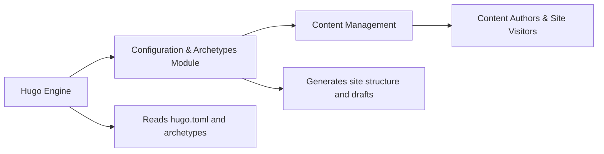

# Hugo Configuration & Archetypes Module

## Overview
This module manages the foundational setup and content scaffolding for the Hugo static website engine. It provides central configuration via `hugo.toml` and automatic content template definition through `archetypes/default.md`, ensuring consistent site behavior and streamlining the creation of new content across the platform.

## Key Features
- **Site Configuration (hugo.toml)**: Defines global site properties, including base URL, language, title, theme selection, and main navigation menus. This ensures site-wide uniformity and foundational behavior.
- **Content Archetyping (archetypes/default.md)**: Supplies a default template for new content entries, automatically applying front matter settings (title, date, draft status) to ensure consistency and accelerate publishing workflows.

## System Errors
- **Missing Configuration Error**: Occurs if `hugo.toml` is misconfigured or absent.  
  *Resolution*: Verify the file presence and ensure required fields (like `baseURL`, `title`, and `theme`) are set correctly.
- **Malformed Archetype Error**: Triggered if `archetypes/default.md` contains invalid front matter syntax.  
  *Resolution*: Check for correct front matter delimiters (`+++` for TOML/YAML) and variable references.

## Usage Examples

```bash
# Creating a new post using the defined archetype
hugo new posts/my-first-post.md
# The resulting file uses title, date, and draft settings from archetypes/default.md

# Example hugo.toml configuration adjustment
# Changing the site title and adding a new menu item
title = 'Le blog de paul - Updated'
[[menu.main]]
name = "Contact"
url = "/contact/"
weight = 4
```

## System Integration


