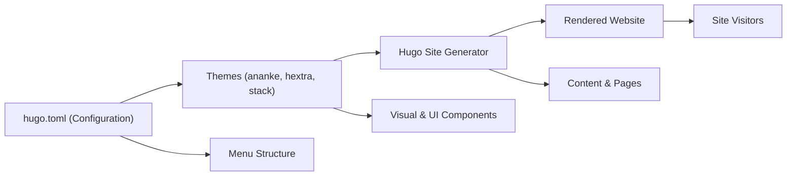

# Hugo Themes Architecture

## Overview
This module governs theme management and integration within the Hugo-based website. Themes define the visual appearance, layout, and foundational UI components across the site. The architecture supports flexible switching and customization of themes, allowing users or developers to tailor the site's look-and-feel through configuration.

## Key Features
- **Theme Selection**: Specifies which visual theme (from available packages) is used for site rendering via the configuration file (`theme = 'hextra'` in `hugo.toml`).
- **Multiple Theme Support**: Enables inclusion and management of multiple themes (`ananke`, `hextra`, `stack`) to allow easy switching or future expansion.
- **Menu Integration**: Coordinates theme menu locations and structure with the site's global navigation, ensuring that menus and navigation links rendered by themes are consistent with site configuration.
- **Content Templating**: Relies on archetype templates (like `archetypes/default.md`) to set default content structure and metadata for new posts, which themes then render according to their styles.
- **Customizable Appearance**: Lets users customize appearance and UI components through configuration variables and theme assets, without modifying core content.

## System Errors
- **Theme Not Found**:  
  *Description*: Attempting to use a theme that is missing or not installed.  
  *Resolution*: Ensure the chosen theme is present in the `/themes` directory, and that the `theme` field in `hugo.toml` matches the folder name.

- **Menu Mismatch**:  
  *Description*: Configured menus in `hugo.toml` do not appear as expected on the site.  
  *Resolution*: Verify that the menu structure in the theme supports the menu entries defined. Consult theme documentation for menu compatibility.

## Usage Examples

```toml
# hugo.toml
baseURL = 'https://paulmazeau.github.io/quickstart'
languageCode = 'en-us'
title = 'Le blog de paul'
theme = 'hextra'

[[menu.main]]
name = "Accueil"
url = "/"
weight = 1

[[menu.main]]
name = "Blog"
url = "/blog/"
weight = 2

[[menu.main]]
name = "About"
url = "/about/about"
weight = 3
```

```markdown
<!-- archetypes/default.md -->
+++
title = '{{ replace .File.ContentBaseName "-" " " | title }}'
date = {{ .Date }}
draft = true
+++
```

## System Integration


