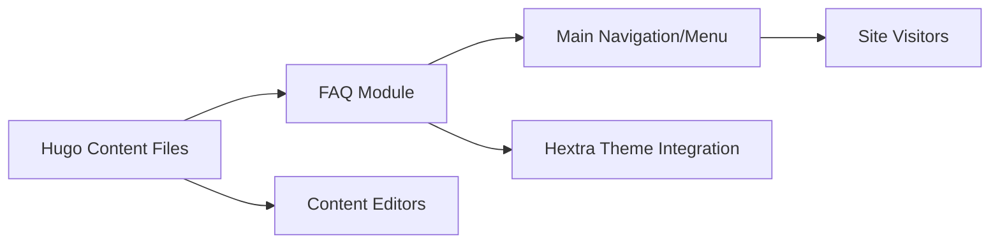

# FAQ Module

## Overview
The FAQ module provides a centralized collection of common questions and answers for users of the website. It is designed to help users quickly find information and resolve common issues without needing direct support, enhancing the overall user experience and reducing support workload.

## Key Features
- **Structured Q&A Display**: Organizes frequently asked questions and their answers in an accessible, searchable format for site visitors.
- **Easy Content Management**: Allows content authors to add, update, or remove FAQs using Hugo’s content management patterns.
- **Seamless Theming and Navigation**: Integrates visually with the site’s existing theme and navigation, ensuring a consistent look and feel.

## System Errors
- **404 Not Found**: Occurs if the FAQ page or referenced content is missing. Resolution: Ensure the FAQ content exists in the appropriate directory.
- **Broken Internal Links**: Some answers may reference non-existent pages. Resolution: Regularly validate that all links in FAQ answers point to valid resources.

## Usage Examples

```markdown
<!-- Example FAQ entry in a Hugo content file -->
## Frequently Asked Questions

### How do I create a new blog post?
To create a new post, add a Markdown file in the `content/blog/` directory with the appropriate front matter.

### Where can I update the site theme?
Modify the `theme` field in `hugo.toml`. Current value: `hextra`.

### How do I change navigation links?
Edit the `[[menu.main]]` entries in `hugo.toml` to add or modify the navigation structure.
```

## System Integration


