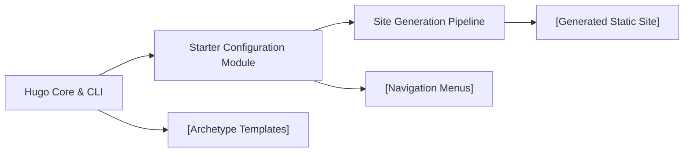

# Hugo Starter Configuration

## Overview
The Hugo Starter Configuration module provides the foundational setup for a Hugo-based static website. It enables new projects to quickly establish a standardized structure—defining global site settings, navigation menus, and default content templates. This module is essential for achieving consistent content management and rapid deployment in Hugo environments.

## Key Features
- **Site Metadata Configuration**: Defines key website properties such as base URL, language code, site title, and theme, ensuring consistent rendering and SEO optimization.
- **Main Navigation Menu**: Pre-configures header menus, enabling easy navigation for users and providing structure for new content sections.
- **Default Archetype Template**: Supplies a boilerplate Markdown structure for creating new posts or pages, promoting content uniformity and saving authoring time.

## System Errors
- **Theme Not Found**: Occurs if the theme specified in the configuration (`hextra`) is missing. _Resolution_: Verify theme installation and correct the theme name in `hugo.toml`.
- **Archetype Parsing Error**: Triggered by malformed archetype files (e.g., syntax errors in `default.md`). _Resolution_: Ensure the front matter syntax is valid and compatible with Hugo.
- **Menu Rendering Issues**: Main menu may not display as expected if navigation items are misconfigured. _Resolution_: Check that each menu item in `hugo.toml` has correct `name`, `url`, and `weight` values.

## Usage Examples

```toml
# hugo.toml
baseURL = 'https://example.com'
languageCode = 'en-us'
title = 'My Hugo Blog'
theme = 'ananke'

[[menu.main]]
name = "Home"
url = "/"
weight = 1

[[menu.main]]
name = "Posts"
url = "/posts/"
weight = 2
```

```markdown
<!-- archetypes/default.md -->
+++
title = '{{ replace .File.ContentBaseName "-" " " | title }}'
date = {{ .Date }}
draft = true
+++

Write your content here.
```

## System Integration


